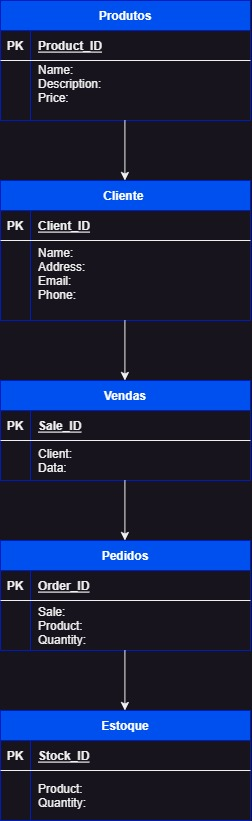

# Gerenciamento de Estoques e Pedidos DNCommerce - Desafio-06

Projeto de Gerenciamento de Vendas
Este é um projeto de gerenciamento de vendas da DNCommerce, onde você pode cadastrar produtos, clientes, realizar vendas, criar pedidos e gerenciar o estoque.

## Iniciando o Projeto
Siga as etapas abaixo para iniciar o projeto em seu ambiente local:

Certifique-se de ter o Node.js e o MongoDB instalados em sua máquina.

Faça o clone deste repositório para o seu diretório local.

Navegue até o diretório raiz do projeto no seu terminal.

Execute o seguinte comando para instalar as dependências do projeto:

npm install;
npm i -- save express mongoose;

Antes de executar o projeto, você precisa configurar a conexão com o banco de dados. 

Abra o arquivo db/conn.js e atualize a URL de conexão com o seu próprio endereço do MongoDB e Password ou crie uma variável de ambiente como no exemplo ".env.example".

Agora você pode iniciar o servidor. Execute o seguinte comando no terminal:

npm start
O servidor será iniciado na porta 3000 e também que o database está conectado. 

## Estrutura do Banco de Dados

O banco de dados utilizado neste projeto é o MongoDB. Ele possui as seguintes coleções:

Produtos
ID: identificador único do produto
Nome: nome do produto
Descrição: descrição do produto
Preço: preço do produto

Clientes
ID: identificador único do cliente
Nome: nome do cliente
Endereço: endereço físico do cliente
Email: endereço de e-mail do cliente
Telefone: número de telefone do cliente

Vendas:
ID: identificador único da venda
Data: data da venda
ClienteID: ID do cliente associado à venda

Pedidos:
ID: identificador único do pedido
VendaID: ID da venda associada ao pedido
ProdutoID: ID do produto associado ao pedido
Quantidade: quantidade do produto no pedido

Estoque:
ProdutoID: ID do produto associado ao estoque
Quantidade: quantidade disponível do produto no estoque

## Rotas
A aplicação possui as seguintes rotas:

### Produtos

GET /api/products: Obtém a lista de produtos

GET /api/products/:id: Obtém um produto pelo ID

POST /api/products: Cria um novo produto

PUT /api/products/:id: Atualiza um produto existente

DELETE /api/products/:id: Exclui um produto

### Clientes
GET /api/clients: Obtém a lista de clientes

GET /api/clients/:id: Obtém um cliente pelo ID

POST /api/clients: Cria um novo cliente

PUT /api/clients/:id: Atualiza um cliente existente

DELETE /api/clients/:id: Exclui um cliente

### Vendas:
GET /api/sales: Obtém a lista de vendas

GET /api/sales/:id: Obtém uma venda pelo ID

POST /api/sales: Cria uma nova venda

PUT /api/sales/:id: Atualiza uma venda existente

DELETE /api/sales/:id: Exclui uma venda

### Pedidos:
GET /api/orders: Obtém a lista de pedidos

GET /api/orders/:id: Obtém um pedido pelo ID

POST /api/orders: Cria um novo pedido

PUT /api/orders/:id: Atualiza um pedido existente

DELETE /api/orders/:id: Exclui um pedido

### Estoque:

GET /api/stock: Obtém a lista de produtos no estoque

GET /api/stock/:id: Obtém um produto no estoque pelo ID

POST /api/stock: Cria um novo registro de estoque

PUT /api/stock/:id: Atualiza um registro de estoque existente

DELETE /api/stock/:id: Exclui um registro de estoque

## Teste 

O teste de rotas poderá ser feito através do Insomnia, Posteman, ThunderClient e etc... Basta importar a rota desejada e selecionar o metodo e seus parametros caso necessite de requisição. 
